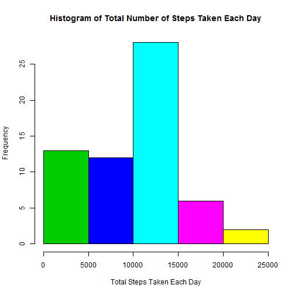
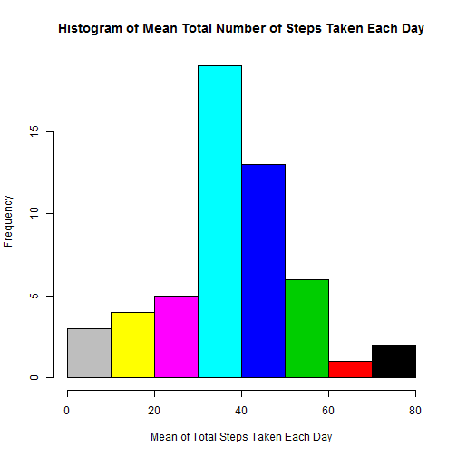
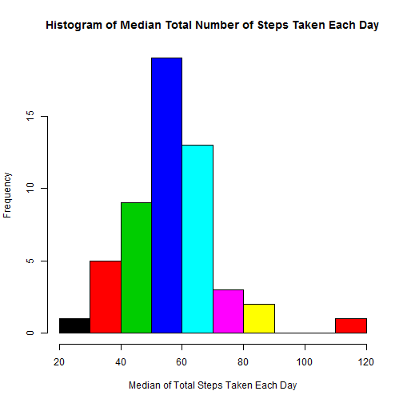
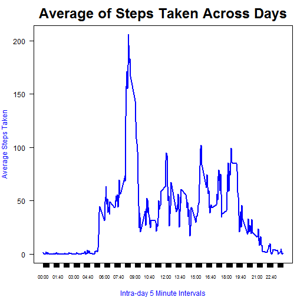
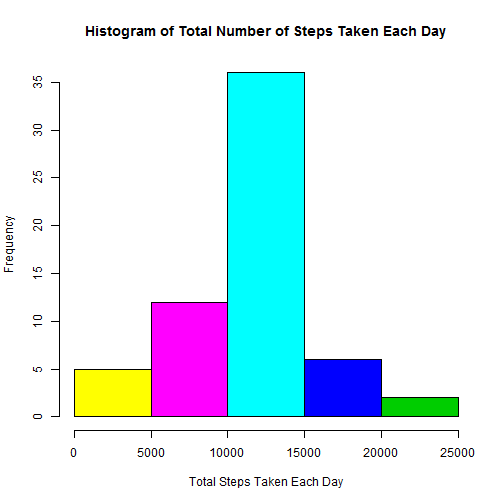
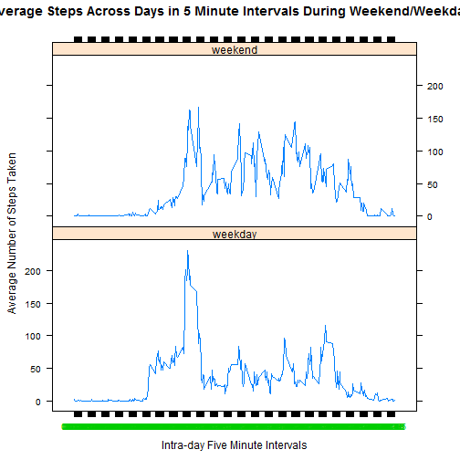

##Introduction
Analysis report to present the findings from assessment of personal movement data as measured by an activitiy monitoring device. The dataset consisted of activity monitoring device data from an anonymous individual, collected during the months of October and November, 2012 and included the number of steps taken in 5 minute intervals each day.


**Download a copy of Activity monitoring dataset from the URL:https://d396qusza40orc.cloudfront.net/repdata%2Fdata%2Factivity.zip and unzip csv file into the working directory as a prerequisite step**

**This document provides literate data analysis with visibility into the R code chunks and results produced**


** **

##Analysis of Steps taken - Graphs of Totals, Mean, Median

Code chunk for reading the downloaded activity.csv file and additional transformations

```r
library(knitr)
actvt_df <- read.csv("./activity.csv", sep = ",", header = TRUE)
actvt_df$date_time <- strptime(paste(actvt_df$date, format(actvt_df$interval/100, nsmall = 2), " "), "%Y-%m-%d %H.%M")
```

Code chunk for making a Histogram of the total number of steps taken each day

```r
steps_df <- aggregate(actvt_df$steps, list(actvt_df$date), FUN = function(x) c(format(sum(x, na.rm = TRUE), nsmall = 7), format(mean(x, na.rm = TRUE), nsmall = 7)))
hist(as.numeric(steps_df$x[, 1]), col = 3:7, main = "Histogram of Total Number of Steps Taken Each Day", xlab = "Total Steps Taken Each Day")
```

 

Code chunk for making a Histogram of the mean total number of steps taken each day

```r
hist(as.numeric(steps_df$x[, 2]), col = 8:1, main = "Histogram of Mean Total Number of Steps Taken Each Day", xlab = "Mean of Total Steps Taken Each Day")
```

 

**Mean of Total steps across all days as a singular value:** 37.3826

** **

Code chunk for making a Histogram of the median total number of steps taken each day

```r
steps_df <- with(actvt_df[(!is.na(actvt_df$steps)) & ((!is.na(actvt_df$steps)) & (actvt_df$steps > 0)), c("date", "steps")], aggregate(steps, by = list(date), FUN = "median"), na.rm = TRUE)
hist(steps_df[, 2], col = 1:8, main = "Histogram of Median Total Number of Steps Taken Each Day", xlab = "Median of Total Steps Taken Each Day")
```

 

**Median of Total steps across all days as a singular value:** 56

** **

##Analysis of Daily Activity Pattern - Five minute interval based averages

Code chunk for making a Time Series Plot of the 5 minute interval and average of steps taken across days

```r
steps_df <- with(actvt_df, aggregate(steps, list(interval), FUN = "mean", na.rm = TRUE))
colnames(steps_df) <- c("interval", "avg_steps")
steps_df$date_time <- strptime(paste(Sys.Date(), format(steps_df$interval/100, nsmall = 2), " "), "%Y-%m-%d %H.%M")
xticks <- steps_df$interval
xlabels <- as.character(steps_df$date_time, "%H:%M")
par(mar = c(4, 4, 3, 0.5))
with(steps_df, plot(interval, avg_steps, axes = FALSE, xaxp = c(0, 2355, 287), type="l", main="Average of Steps Taken Across Days", ylab="Average Steps Taken", xlab="Intra-day 5 Minute Intervals", col = "blue", lwd = 2, cex = 2, col.lab = "blue", cex.main = 2))
box()
axis(side = 1, at = xticks, labels = xlabels, cex.lab = 0.4, cex.axis = 0.7)
axis(side = 2, at = pretty(steps_df$avg_steps), las = 2)
```

 

** **

####The 5-minute interval, with maximum number of average steps taken across all the days in the dataset
Starting Minute in HH:MM format: 08:35
 
** **

####Total number of rows with missing values (coded as NA)
Count of Observations: 2304

** **

**Strategy to impute missing values for *Steps*  variable:**

- As the test subject is same person and all observations were collected over days during the equivalent five minute intervals, the effective donor to impute values can be average of steps taken in the exact same five minute interval across days.

 - This approach is based on the foundation that a test subject might have repeated the steps taken on any given day again on a different day, if the routine is kept same. Thus the average would be the closest donor, as similar number of steps could be taken in a given five minute interval if the activity/routine repeats
 
 - Do not impute steps whose collected value is zero. Only impute uncollected/missing values for steps
 
** **

Code chunk for imputing missing values and plot a histogram of average steps taken each day

```r
actvt_df$avg_steps <- rep(steps_df$avg_steps, 61)
actvt_df$imputed_steps <- ifelse(is.na(actvt_df$steps), actvt_df$avg_steps, actvt_df$steps)
steps_df <- aggregate(actvt_df$imputed_steps, list(actvt_df$date), FUN = sum)
hist(as.numeric(steps_df[, 2]), col = 7:3, main = "Histogram of Total Number of Steps Taken Each Day", xlab = "Total Steps Taken Each Day")
```

 

####Mean and Median of total *Steps*  taken, post imputation of missing values
**Mean of Total steps across all days as a singular value:** 37.3826

** **

**Median of Total steps across all days as a singular value:** 45.33962

** **

####Differences in activity patterns between weekdays and weekends

Code chunk to add a day factor and plot time series activity pattern during weekdays vs weekend period

```r
library(lattice)
actvt_df$wkend_fctr <- ifelse(factor(weekdays(actvt_df$date_time)) %in% c("Saturday", "Sunday"), "weekend", "weekday")
steps_df <- with(actvt_df, aggregate(imputed_steps, list(wkend_fctr, interval), FUN = "mean", na.rm = TRUE))
colnames(steps_df) <- c("wkend_fctr", "interval", "avg_steps")
steps_df$date_time <- strptime(paste(Sys.Date(), format(steps_df$interval/100, nsmall = 2), " "), "%Y-%m-%d %H.%M")
xticks <- steps_df[(steps_df$wkend_fctr == "weekend"), "interval"]
xlabels <- as.character(steps_df[(steps_df$wkend_fctr == "weekend"), "date_time"], "%H:%M")
with(steps_df, xyplot(avg_steps~interval|wkend_fctr, 
       main = "Average Steps Across Days in 5 Minute Intervals During Weekend/Weekday",
       ylab = "Average Number of Steps Taken",
       xlab = "Intra-day Five Minute Intervals",
       layout = c(1,2), type = "l", lwd = 1.5,
       scales = list(x = list(at = xticks, labels = xlabels, col = 3))))
```

 

** **
